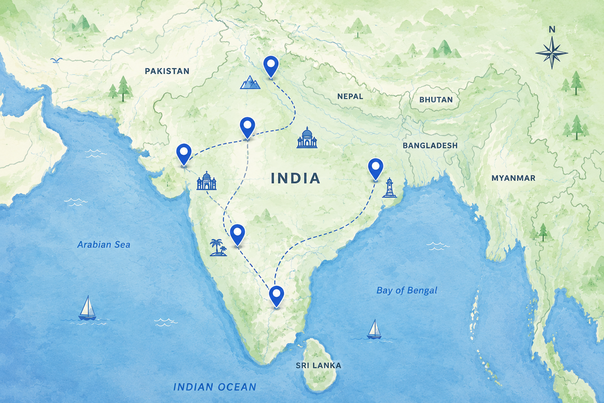

<div align="center">

# ✈️ KIBI

### Your journey. Smarter planned.

**A modern travel planner built to turn the chaos of trip planning into a simple, beautiful experience.**

<br>

[](#)
[](https://github.com/Bhargav-bit567/Kibi)

<br>


<br>

**Discover → Plan → Explore → Remember**

</div>

---

## 🌍 The Problem

Planning a trip sounds exciting.

Actually planning one? Not always.

Travelers often jump between dozens of tabs trying to figure out:

- 📍 Where to go
- 🗓️ What to do each day
- 💰 How much to spend
- 🏨 Where to stay
- 🍜 What to eat
- 🗺️ Which places are worth visiting
- 📝 How to keep everything organized

The information exists — but it's scattered everywhere.

> **Trip planning shouldn't feel like project management.**

That's the problem **Kibi** is built to solve.

---

## 💡 What is Kibi?

**Kibi** is a modern travel-planning web application designed to make planning a journey simple, visual, and enjoyable.

Instead of manually organizing every detail, Kibi provides one place where travelers can discover destinations, build their trip, organize plans, and manage their journey.

The idea is simple:

> **Spend less time planning the trip. Spend more time experiencing it.**

---

## ✨ What Kibi Helps You Do

Kibi brings the important parts of travel planning into one experience.

### 🔎 Discover

Explore destinations and find inspiration for your next journey.

### 🧳 Plan

Build your trip around your destination, dates, preferences, and travel style.

### 🗓️ Organize

Keep your itinerary and important trip information structured instead of scattered across multiple apps.

### 📍 Explore

Visualize destinations and places that can become part of your journey.

### 📊 Manage

Keep track of your planned trips from a simple dashboard.

---

## 🚀 Features

| Feature | Description |
|---|---|
| 🌍 **Destination Discovery** | Explore destinations and get inspiration for your next trip |
| 🗓️ **Trip Planning** | Create and organize personalized travel plans |
| 🧭 **Itinerary Builder** | Structure your journey day by day |
| 📍 **Destination Maps** | Visualize places and travel destinations |
| 📊 **Trip Dashboard** | Manage your planned trips from one place |
| 🔐 **Authentication** | Login and signup experience for users |
| 🌙 **Dark Mode** | Comfortable interface for both light and dark environments |
| 💾 **Local Storage** | Preserve trip information directly in the browser |
| 📱 **Responsive Design** | Designed to work across desktop, tablet, and mobile |

---

## 🧭 How Kibi Works

```text
                ✈️ Start Your Journey
                         │
                         ▼
                🌍 Choose Destination
                         │
                         ▼
                  📅 Select Dates
                         │
                         ▼
              🎯 Set Your Preferences
                         │
                         ▼
                  🧳 Build Your Trip
                         │
                         ▼
                🗓️ View Your Plan
                         │
                         ▼
                  🌎 Start Exploring
```

From an idea to an organized journey — without the planning chaos.

---

## 📸 Inside Kibi

<div align="center">

### 🌍 Discover


<br><br>

### 🗺️ Explore



<br><br>

### 🧳 Plan Your Journey


</div>

---

## 🛠️ Tech Stack

<div align="center">


</div>

### Core Technologies

- **HTML5** — page structure
- **Tailwind CSS** — styling and responsive design
- **Vanilla JavaScript** — application logic and interactivity
- **Local Storage** — browser-side data persistence
- **Git & GitHub** — version control and collaboration

---

## 📁 Project Structure

```text
Kibi/
├── index.html              🏠 Landing page
├── discover.html           🔍 Browse destinations
├── plan-trip.html          📅 Trip planner
├── itinerary.html          🧭 Generated itinerary
├── my-trips.html         🧳 Trip list
├── dashboard.html        👤 Profile & stats
├── saved-itinerary.html  💾 Saved itineraries
├── login.html / signup.html
├── js/                   Shared modules
│   ├── app.js            Navbar, footer, theme
│   ├── auth.js           Authentication
│   ├── storage.js        Data & localStorage
│   ├── trips.js          Trip rendering
│   └── matching.js       Destination matching
├── assets/               Images & icons
├── server.py             Local dev server
└── README.md           📖 This file
```
## ⚡ Getting Started

### 1. Clone the repository

```bash
git clone https://github.com/Bhargav-bit567/Kibi.git
```

### 2. Enter the project

```bash
cd Kibi
```

### 3. Open the application

Open:

```text
index.html
```

in your browser.

For a better development experience, you can also run the project using a local development server such as **Live Server** in VS Code.

---

## 🎯 Project Vision

Kibi started with one question:

> **What if planning a trip felt as exciting as taking one?**

The long-term vision is to build Kibi into an intelligent travel companion that can help travelers move from:

```text
"I want to travel somewhere."
            ↓
"Here's your journey."
```

with as little friction as possible.

---

## 🗺️ Roadmap

Kibi is still evolving.

Future possibilities include:

- [ ] 🤖 AI-generated personalized itineraries
- [ ] 🌦️ Live weather information
- [ ] 🏨 Hotel discovery
- [ ] ✈️ Flight discovery
- [ ] 💰 Advanced travel budget planning
- [ ] 📍 Real-time maps and location data
- [ ] 🍜 Restaurant and attraction recommendations
- [ ] ☁️ Cloud-based trip synchronization
- [ ] 👥 Collaborative trip planning
- [ ] 📱 Progressive Web App support
- [ ] 🌎 More destinations and travel data

---


<div align="center">

## ✈️ KIBI

### Don't just plan a trip. Build a journey.

Made with ☕, code, and a little bit of wanderlust.

<br>

[⬆ Back to Top](#️-kibi)

</div>
---

## 🌐 Deploy

1. Push this repo to GitHub
2. Import it on [Vercel](https://vercel.com)
3. Add environment variables
4. Deploy 🎉

---


